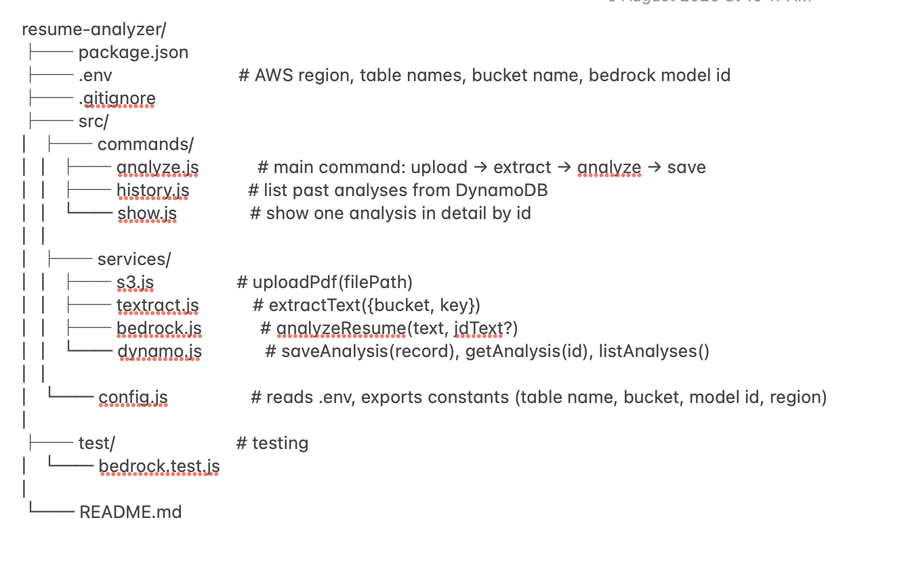
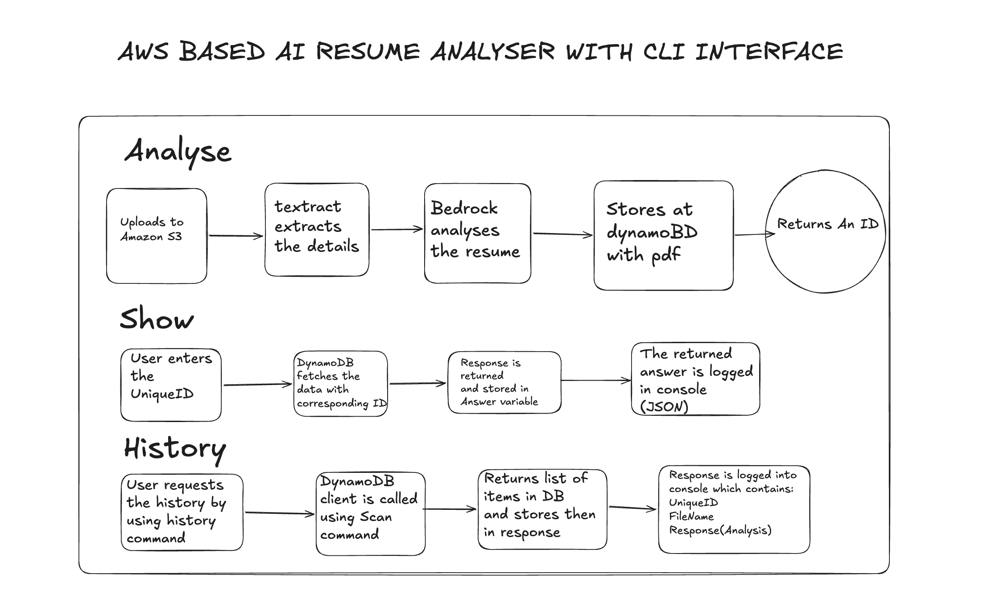
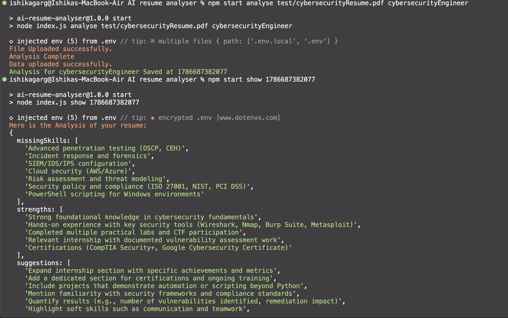
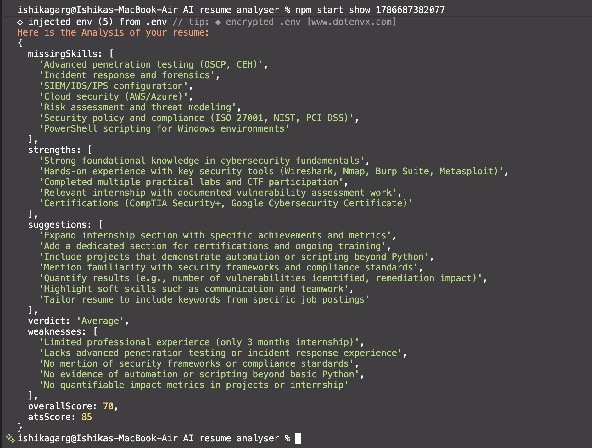

# AWS based AI Resume Analyser (CLI)

It is a CLI tool that analyzes resumes using AWS services and an LLM.
Upload a resume PDF, get an ATS score, strengths/weaknesses breakdown, and improvement suggestions.
Saved in Database to access other resume.

## Features

- Extracts text from resume PDFs
- Analyzes the resume using an LLM (Amazon Bedrock)
- Generates an Overall Score and ATS Score (0–100)
- Lists strengths, weaknesses, and missing skills
- Suggests concrete improvements
- Saves every analysis so it can be looked up later by ID

## Tech Stack

| Purpose            | Service / Library                                        |
| ------------------ | -------------------------------------------------------- |
| CLI framework      | [Commander.js](https://github.com/tj/commander.js)       |
| File storage       | Amazon S3                                                |
| Text extraction    | Amazon Textract _(with `pdf-parse` as a local fallback)_ |
| LLM analysis       | Amazon Bedrock (Anthropic Claude models)                 |
| Data persistence   | Amazon DynamoDB                                          |
| Auth / permissions | AWS IAM                                                  |
| Runtime            | Node.js (ES Modules)                                     |

## NOTE

- I was not able to use textract as it is no longer available for free accounts in AWS.
- I have replaced it with pdf parse (npm module).

# File Structure



# Flow Chart



**Design principle:** commands orchestrate, services execute. Each AWS service is isolated in its own file, so swapping implementations (e.g. Textract → local `pdf-parse`, or Bedrock → direct Anthropic API) only touches one file.

## AWS Resources Used

| Resource             | Purpose                                                              |
| -------------------- | -------------------------------------------------------------------- |
| S3 bucket            | Stores uploaded resume PDFs                                          |
| DynamoDB table       | Stores analysis results, keyed by a unique numeric ID                |
| Bedrock model access | Runs the LLM analysis (Anthropic Claude, or an alternative provider) |
| IAM user + policy    | Scoped permissions for S3, Bedrock, DynamoDB, and Textract           |

### IAM permissions required

- `s3:PutObject`, `s3:GetObject`
- `bedrock:InvokeModel`
- `dynamodb:PutItem`, `dynamodb:GetItem`, `dynamodb:Scan`
- `textract:*` _(if using Textract instead of the local fallback)_
- `aws-marketplace:Subscribe`, `aws-marketplace:Unsubscribe`, `aws-marketplace:ViewSubscriptions`
  > **Note on least privilege:** during development it's common to prototype with broad managed policies (e.g. `AmazonS3FullAccess`) and tighten to a scoped custom policy once resource names/ARNs are finalized. This project's design keeps AWS calls isolated per-service specifically to make that tightening easy.

## Known Issues / Notes

- Some of The most common issues I ran into:
- **Bedrock + Anthropic Marketplace access**: Anthropic models on Bedrock require a one-time use-case form and a verified payment method through AWS Marketplace, separate from general AWS billing. UPI-based payment methods have been unreliable for this specific verification step; a standard credit/debit card is recommended.
- **PDF text extraction**: `pdf-parse` only reads embedded text layers and won't OCR scanned/image-based resumes. Amazon Textract is the more capable (but not accessable) alternative for that case.

## Setup

1. **Clone and install dependencies**

```bash
   npm install
```

2. **Create your `.env` file** (see .env.example)

```env
   AWS_REGION=us-east-1
   S3_BUCKET_NAME=your-bucket-name
   DYNAMO_TABLE_NAME=ResumeAnalyses
   BEDROCK_MODEL_ID=anthropic.claude-haiku-4-5-20251001-v1:0
```

3. **Create AWS resources**
   - S3 bucket (Global namespace, block public access on)
   - DynamoDB table with partition key `uniqueID` (Number)
   - Request Bedrock model access via the Model catalog
4. **Configure AWS CLI credentials**

```bash
   aws configure
```

## Usage

```bash
# Analyze a resume
node index.js analyse ./path/to/resume.pdf

# View all past analyses
node index.js history

# View a specific analysis by ID
node index.js show <analysisId>
```

## Example Output




## Possible Future Improvements

- `chalk`/`ora` for colored output and loading spinners
- Retry/error-handling improvements across the S3 → Textract → Bedrock → DynamoDB pipeline

## Bibliography

- [aws-sdk/dynamoDB](https://www.npmjs.com/package/@aws-sdk/client-dynamodb)
- [aws-sdk/s3](https://www.npmjs.com/package/@aws-sdk/client-s3)
- [aws-sdk/bedrock](https://www.npmjs.com/package/@aws-sdk/client-bedrock-runtime)
- all command pages accessible through these links
- [youtube-tutorials](youtube.com)
- [medium-articles](https://sumantmishra.medium.com/connecting-and-using-aws-dynamodb-remotely-with-nodejs-13e199784dd3)

...and much more
